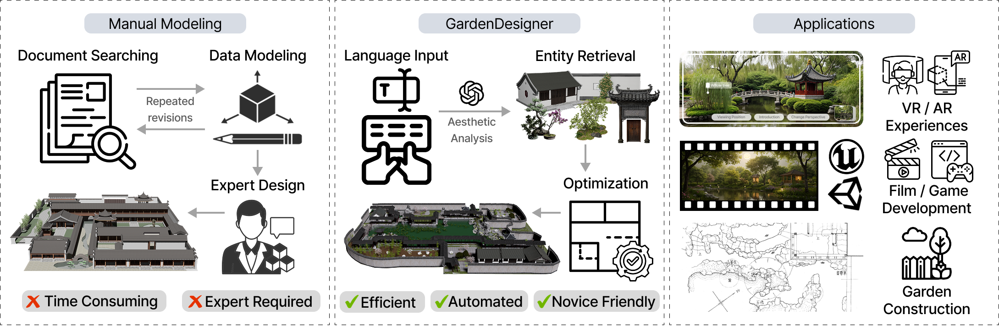

# GardenDesigner: Encoding Aesthetic Principles into Jiangnan Garden Construction via a Chain of Agents (CVPR 2026)

<b>Zhaoxing Gan¹, Mengtian Li¹²†, Ruhua Chen³, Zhongxia Ji³,  
Sichen Guo³, Huanling Hu¹, Guangnan Ye¹†, Zuo Hu³</b>

¹Shanghai University, ²Shanghai Engineering Research Center of Motion Picture Special Effects, ³The Hong Kong University of Science and Technology (Guangzhou)  

📧 {mtli, yangphan, ruixuexiong, yiyanfan, zhifeng_xie}@shu.edu.cn, zeyuwang@ust.hk

<h5 align="center">
 
</h5>

#### Environment

`Python 3.8` (not tested with other Python versions, but it should be OK as long as the dependencies are alright)

Install the dependencies: `pip install -r requirements.txt`

An OpenAI API key is required to enable LLM queries. Put it in the `.env` file.

#### Structure

Codes are mainly in `main.py` and `pcg.py`.

`sys_msg_en.py` lists the prompts for LLM queries.

`data/data.json` stores some information about the used landscape models. (Please also refer to the Unity client repo)

The generation results will be stored in `outputs/` .

#### Landscape Generation

Basic usage: `python main.py`

Possible arguments:

- `-q` The generation will use LLM queries. When not adding this, the generation use the default parameters and does not need LLM.
- `-t [description text]` The user input.
- `-n [number of scenes]`  The number of scenes to generate. By default, the program only generate one scene at a time.
- `-s [the random seed]` Specify it if needed.
- `-c [checkpoint name]` A checkpoint stores a part of the generation result. (You can actually ignore this)

### Visualization
The direct outputs will be stored in `outputs/`. Move them to the Unity client repo and you can finally see the landscape scenes in Unity. (Unity client repo is being prepared)

### Dataset
If you want to use the StagePro-v1 dataset for non-commercial use, please fill the [release agreement](agreement.pdf) and send email to yangphan@shu.edu.cn

## Citation
Please cite the paper if you feel it is useful.